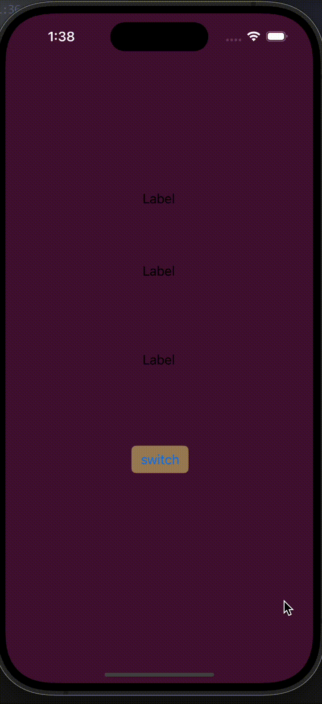

# Prework - *IOS*

Submitted by: **Dale Yu**

Color Changer is an app that changes the background color to a random color when pressing a button.

Time spent: **.2** hours spent in total

## Required Features

The following **required** functionality is completed:

- [ ] Users are see a screen with three labels and a button
- [ ] Tapping the button changes the screen color to a random color

## App Brainstorming (Step 4)
### App Brainstorming

#### Favorite Applications:

1. **Notion**
   - innovated templates and allows for market place
   - sharing of documents and storyboards
2. **Line**
   - Very convenient to get new contacts
   - minimal user interface. 
3. **Google Maps**
   - Simple user interface
   - Has additional features like keeping saved and liked places

#### App Idea: 

**GreenHabit - Sustainable Living Companion**

GreenHabit is a comprehensive app designed to foster sustainable living habits among its users. It aims to blend the concepts of environmental education, personal habit tracking, and community challenges to encourage and facilitate a greener lifestyle. GreenHabit provides tools and resources for users to understand their environmental impact, make more sustainable choices, and connect with a like-minded community.

Key Features:

Eco-Footprint Calculator:

Users start by calculating their current ecological footprint through a detailed quiz covering food consumption, transportation modes, energy usage, and waste production.
The app provides a personalized report highlighting areas for improvement and potential impact reduction.
Sustainable Habit Tracker:

Customizable tracker for users to set and monitor their daily, weekly, and monthly green habits (e.g., reducing water usage, recycling, using public transportation).
Gamification elements like achievements, levels, and rewards to motivate consistent practice.
Challenge Mode:

Weekly and monthly challenges to encourage users to try new sustainable practices (e.g., Zero Waste Week, Vegan Challenge, Car-Free Days).
Users can join community challenges or create private challenges with friends and family.

## Challenges
No Challenges

## License

    Copyright [yyyy] [name of copyright owner]

    Licensed under the Apache License, Version 2.0 (the "License");
    you may not use this file except in compliance with the License.
    You may obtain a copy of the License at

        http://www.apache.org/licenses/LICENSE-2.0

    Unless required by applicable law or agreed to in writing, software
    distributed under the License is distributed on an "AS IS" BASIS,
    WITHOUT WARRANTIES OR CONDITIONS OF ANY KIND, either express or implied.
    See the License for the specific language governing permissions and
    limitations under the License.
